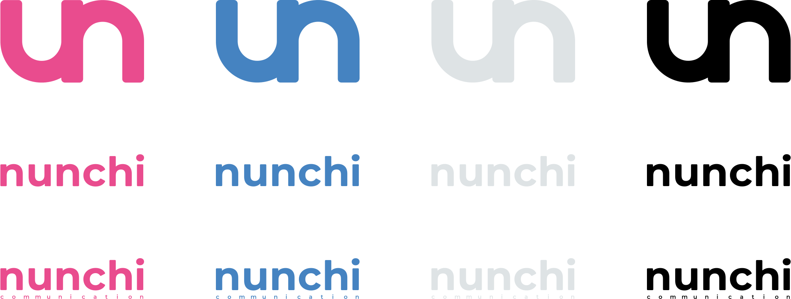
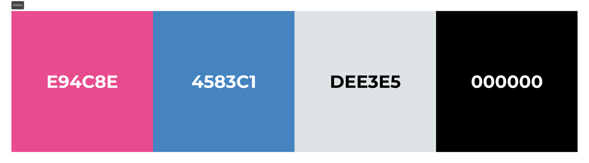

# Assets

## Logos

## Icons

## Colors

## Favicons

## Licence

This project is distributed under [GNU General Public License version 3](https://opensource.org/license/gpl-3-0). You can find the complete text of the license in the project repository.
